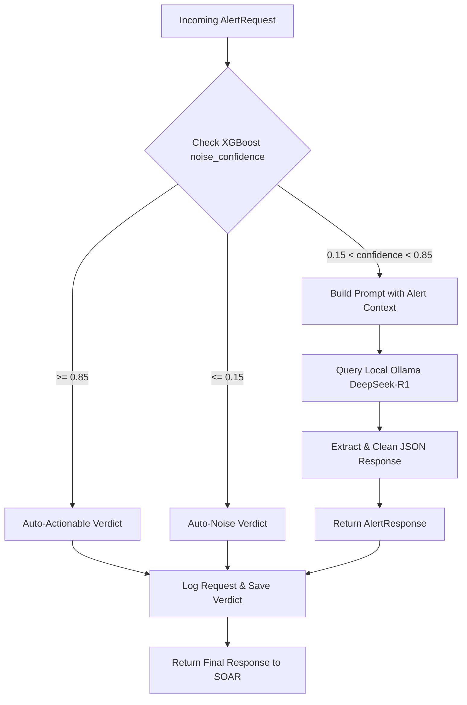

# Alert Intelligence Service (Noise LLM Decision Layer)

The **Alert Intelligence Service** acts as a smart decision layer designed for integration into the **CyberNest SOAR** (Security Orchestration, Automation, and Response) platform. It uses a hybrid approach—combining lightweight machine learning classification confidence with a localized Large Language Model (LLM)—to classify normalized security alerts (e.g., from Wazuh) as either **actionable** (requiring manual analyst triage or playbook execution) or **noise** (safe to automate away/dismiss).

---

## 1. System Architecture

The service optimizes latency and resource usage by implementing a **hybrid routing pipeline**:

1. **Deterministic XGBoost Filter**: Incoming alerts include a `noise_confidence` score pre-calculated by an XGBoost model.
   - **Auto-Actionable**: If `noise_confidence` $\ge$ `0.85`, the alert is immediately classified as **actionable**.
   - **Auto-Noise**: If `noise_confidence` $\le$ `0.15`, the alert is immediately classified as **noise** (expressed as $1.0 - \text{noise\_confidence}$ confidence of being noise).
2. **LLM Delegation**: For intermediate values (`0.15` < `noise_confidence` < `0.85`), the service delegates decision-making to a locally-hosted LLM (e.g., DeepSeek-R1 via Ollama) mimicking a Senior Tier-3 SOC analyst.



---

## 2. API Specifications & Data Schemas

The service is built on **FastAPI** and uses **Pydantic** for input/output model enforcement.

### Analysis Endpoint
* **URL**: `/analyze`
* **Method**: `POST`
* **Content-Type**: `application/json`

### Request Payload (`AlertRequest`)

The `/analyze` endpoint expects a JSON object matching the following structure:

| Field | Type | Description |
| :--- | :--- | :--- |
| `alert_id` | `string` | Unique identifier of the security alert (e.g., from Wazuh). |
| `alert_severity` | `integer` | Raw numeric severity score of the alert (typically 1 to 15). |
| `enrichment_vt_score` | `float` | VirusTotal malicious detection percentage / score. |
| `enrichment_abuse_score` | `float` | AbuseIPDB abuse confidence score (0.0 to 100.0). |
| `asset_criticality` | `string` | Criticality classification of the target asset (`high`, `medium`, `low`). |
| `similar_alerts_last_hour` | `integer` | Count of similar alerts seen targeting the same asset/network in the last hour. |
| `maintenance_window` | `boolean` | Flag indicating if the alert occurred during a scheduled maintenance window. |
| `known_admin_activity` | `boolean` | Flag indicating if the alert correlates with known admin actions. |
| `noise_confidence` | `float` | XGBoost model noise confidence score (value between `0.0` and `1.0`). |

#### Request JSON Example:
```json
{
  "alert_id": "med-555",
  "alert_severity": 10,
  "asset_criticality": "high",
  "enrichment_vt_score": 90.0,
  "enrichment_abuse_score": 75.0,
  "similar_alerts_last_hour": 50,
  "maintenance_window": false,
  "known_admin_activity": false,
  "noise_confidence": 0.62
}
```

### Response Payload (`AlertResponse`)

The endpoint returns a structured response outlining the decision:

| Field | Type | Description |
| :--- | :--- | :--- |
| `verdict` | `string` | The final categorization of the alert: `"actionable"` or `"noise"`. |
| `confidence` | `float` | The confidence level of the decision (value between `0.0` and `1.0`). |
| `severity` | `string` | The contextualized, adjusted severity rating: `"low"`, `"medium"`, `"high"`, or `"critical"`. |
| `reasoning` | `string` | A detailed technical justification detailing the threat analysis and final determination. |

#### Response JSON Example:
```json
{
  "verdict": "actionable",
  "confidence": 0.91,
  "severity": "high",
  "reasoning": "The alert is flagged with high severity (10) targeting a high-criticality asset. Threat intelligence sources indicate high malicious indicators (VirusTotal: 90% and AbuseIPDB: 75%). Although the XGBoost model shows medium confidence, the combination of asset value and intelligence scores warrants actionable response."
}
```

---

## 3. Core Component Layout

The codebase inside [ALERT_INTELLIGENCE_SERVICE](file:///c:/Users/Pavlly/OneDrive/Desktop/NOISE_LLM/ALERT_INTELLIGENCE_SERVICE/) is structured as follows:

* **[app.py](file:///c:/Users/Pavlly/OneDrive/Desktop/NOISE_LLM/ALERT_INTELLIGENCE_SERVICE/app.py)**: Serves endpoints (`/analyze`, `/health`) and wraps global service errors in Pydantic-compliant fallbacks.
* **[config.py](file:///c:/Users/Pavlly/OneDrive/Desktop/NOISE_LLM/ALERT_INTELLIGENCE_SERVICE/config.py)**: Manages local settings using `pydantic-settings`. Configures default ports, logs, models, and file paths.
* **[schemas.py](file:///c:/Users/Pavlly/OneDrive/Desktop/NOISE_LLM/ALERT_INTELLIGENCE_SERVICE/schemas.py)**: Declares data boundaries for Request/Response validation.
* **[llm_service.py](file:///c:/Users/Pavlly/OneDrive/Desktop/NOISE_LLM/ALERT_INTELLIGENCE_SERVICE/llm_service.py)**: Implements XGBoost routing logic, converts raw severity to words (`low`/`medium`/`high`/`critical`), and logs transactions.
* **[llm_client.py](file:///c:/Users/Pavlly/OneDrive/Desktop/NOISE_LLM/ALERT_INTELLIGENCE_SERVICE/llm_client.py)**: Handles REST communication with Ollama. Contains robust JSON extractors that remove `<think>` reasoning blocks (crucial for models like DeepSeek-R1) and handle connection retries/fallbacks.
* **[prompt_builder.py](file:///c:/Users/Pavlly/OneDrive/Desktop/NOISE_LLM/ALERT_INTELLIGENCE_SERVICE/prompt_builder.py)**: Loads and interpolates variables into the static system prompt template found at `prompts/soc_analyst_prompt.txt`.

---

## 4. How to Integrate the Service Into Another Project

To invoke this service from your main SOAR platform or another microservice, implement one of the client patterns below.

### Python Integration Examples

#### Synchronous Call (using `requests`)
```python
import requests

def analyze_alert(payload: dict) -> dict:
    url = "http://localhost:8000/analyze"
    try:
        response = requests.post(url, json=payload, timeout=65.0)
        response.raise_for_status()
        return response.json()
    except requests.exceptions.RequestException as e:
        # Graceful handling for connection drops
        return {
            "verdict": "unknown",
            "confidence": 0.0,
            "severity": "unknown",
            "reasoning": f"Failed to reach Alert Intelligence Service: {e}"
        }

# Example Usage
alert_payload = {
    "alert_id": "integration-001",
    "alert_severity": 12,
    "asset_criticality": "high",
    "enrichment_vt_score": 95.0,
    "enrichment_abuse_score": 85.0,
    "similar_alerts_last_hour": 1,
    "maintenance_window": False,
    "known_admin_activity": False,
    "noise_confidence": 0.50
}
result = analyze_alert(alert_payload)
print(f"Verdict: {result['verdict']} | Severity: {result['severity']}")
```

#### Asynchronous Call (using `httpx`)
```python
import httpx
import asyncio

async def analyze_alert_async(payload: dict) -> dict:
    url = "http://localhost:8000/analyze"
    async with httpx.AsyncClient(timeout=70.0) as client:
        try:
            response = await client.post(url, json=payload)
            response.raise_for_status()
            return response.json()
        except httpx.HTTPError as e:
            return {
                "verdict": "unknown",
                "confidence": 0.0,
                "severity": "unknown",
                "reasoning": f"Async API connection error: {e}"
            }

async def main():
    alert_payload = {
        "alert_id": "async-integration-002",
        "alert_severity": 4,
        "asset_criticality": "low",
        "enrichment_vt_score": 0.0,
        "enrichment_abuse_score": 5.0,
        "similar_alerts_last_hour": 12,
        "maintenance_window": True,
        "known_admin_activity": True,
        "noise_confidence": 0.08
    }
    result = await analyze_alert_async(alert_payload)
    print(result)

if __name__ == "__main__":
    asyncio.run(main())
```

---

## 5. Configuration & Environment Variables

Create or update a `.env` file inside the [ALERT_INTELLIGENCE_SERVICE](file:///c:/Users/Pavlly/OneDrive/Desktop/NOISE_LLM/ALERT_INTELLIGENCE_SERVICE/) directory to configure runtime settings:

| Variable | Default Value | Description |
| :--- | :--- | :--- |
| `HOST` | `"0.0.0.0"` | IP address to bind the FastAPI server. |
| `PORT` | `8000` | Port to expose the FastAPI server. |
| `ENV` | `"standalone"` | Deployment environment name (e.g., `production`, `development`). |
| `OLLAMA_URL` | `"http://localhost:11434"` | Base URL of the Ollama server. |
| `OLLAMA_MODEL` | `"deepseek-r1:8b"` | Model tag pulled locally in Ollama. |
| `OLLAMA_TIMEOUT_SEC`| `60.0` | Maximum wait time for LLM generation response. |
| `OLLAMA_RETRIES` | `3` | Number of retry attempts with exponential backoff on failure. |

---

## 6. Local Setup & Execution Guide

### Prerequisites
1. **Python 3.10+** installed.
2. **Ollama** installed and running on your system.

### Step 1: Prepare the LLM
Before launching the service, ensure the configured Ollama model is downloaded:
```bash
# Pull the DeepSeek model (or your customized model tag)
ollama pull deepseek-r1:8b
```

### Step 2: Install Dependencies
Create a virtual environment and install the required Python packages:
```bash
cd ALERT_INTELLIGENCE_SERVICE

# Create and activate virtual environment
python -m venv .venv
source .venv/bin/activate  # On Windows: .venv\Scripts\activate

# Install requirements
pip install -r requirements.txt
```

### Step 3: Run the FastAPI App
Start the service in reload/development mode:
```bash
python app.py
```
*The service will start listening on `http://localhost:8000`.*

---

## 7. Logging & Historical Data

Every request passing through the service is logged and saved:

1. **Transaction Log (`logs/llm.log`)**:
   - Single-line JSON objects tracing transaction metadata.
   - Example:
     ```json
     {"timestamp": "2026-06-13T00:15:30Z", "alert_id": "med-555", "llm_verdict": "actionable", "confidence": 0.91}
     ```
2. **Detailed History (`output/verdicts.json`)**:
   - A structural JSON array recording both full input payloads and complete resolved output schemas. Useful for auditing and retraining machine learning models.

---

## 8. Testing and Quality Verification

The project includes unit and integration tests written in `pytest` to guarantee reliability.

### Running the Test Suite
Execute the tests using the command below:
```bash
cd ALERT_INTELLIGENCE_SERVICE
pytest
```

### Test Files Overview:
- `tests/test_api.py`: Tests the API router endpoints, including automatic routing logic bypassing the LLM.
- `tests/test_llm.py`: Tests the LLM client, including formatting and parsing responses.
- `tests/test_ollama_integration.py`: Validates physical connectivity to local Ollama, checks model availability, handles reasoning-tag cleanup, and tests API fallback rules under outage conditions.
- `tests/test_pipeline.py`: Runs end-to-end service assertions checking logs and JSON output files.
