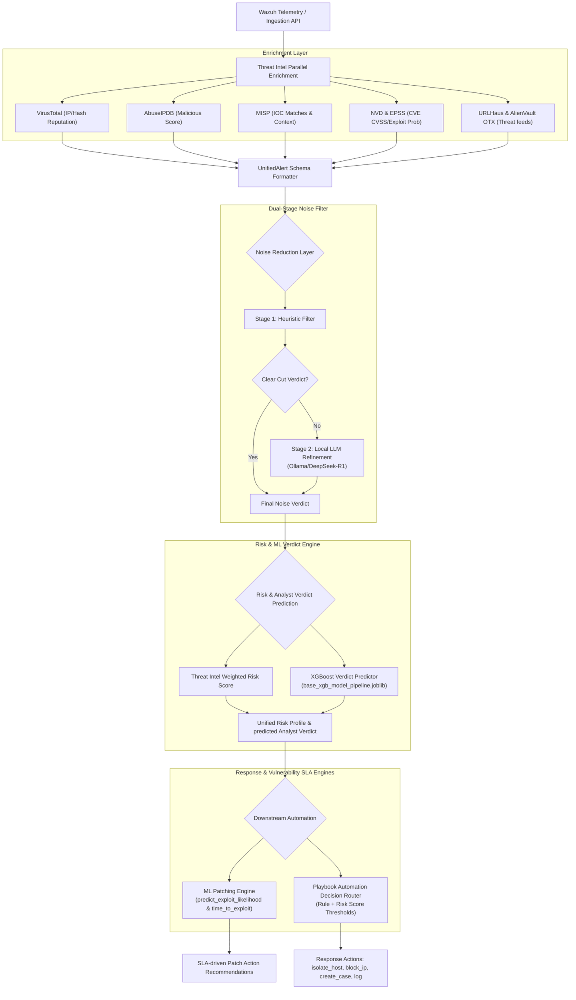

# CyberNest SOAR — AI & Machine Learning Architecture Flow

This document details the complete **AI and Machine Learning data flow** across the CyberNest SOAR platform. It maps the transition of raw security telemetry alerts into enriched, risk-evaluated, automated response workflows and LLM training datasets.

---

## 1. High-Level AI Architecture Flow

The following Mermaid diagram visualizes the end-to-end processing pipeline of a security alert. It shows how parallel threat intel enrichment feeds into the dual-stage noise filter, risk-scoring engine, ML-driven patching engine, and playbook routing.

---

## 2. Ingestion & Parallel Threat Intel Enrichment

When telemetry (such as a Wazuh alert) enters the system, it is passed through the enrichment services to query external APIs in parallel:

*   **VirusTotal**: Obtains detection score and malicious counts for file hashes and IPs.
*   **AbuseIPDB**: Retrieves abuse reporting scores.
*   **MISP**: Performs IOC lookups for existing threat campaigns.
*   **NVD & EPSS**: Looks up CVSS severity scores and EPSS exploit probability scores for CVEs.
*   **URLHaus & AlienVault OTX**: Queries active malware URLs and threat pulses.

All details are consolidated into the `UnifiedAlert` Pydantic model. To bridge the gap between inference and training, the `GET /api/v1/alerts/training-format` endpoint flattens the nested structures into a **111-field flat dataset schema**, matching the format used to train the machine learning models.

---

## 3. Dual-Stage Noise Filtering

Designed in [filtering.py (service)](file:///c:/Users/Pavlly/OneDrive/Desktop/SOAR/CyberNest-Soar/backend/app/soar_backend/services/filtering.py), the noise reduction pipeline filters high-volume alert noise from actionable incidents:

### Stage 1: Heuristic Classifier
Performs rapid filtering using predefined statistical criteria:
1.  **Noise**: If severity < 6, alert frequency (last 5 min) > 20, and unique source IPs = 1.
2.  **Important**: If severity ≥ 10, or IP reputation score < 20.
3.  **Review**: Alerts that do not fall strictly into the above categories.

### Stage 2: Machine Learning & LLM Refinement
For alerts classified as "noise" or "review," the system executes an ML or local LLM classification:
*   **XGBoost Classifier**: [predict_noise.py](file:///c:/Users/Pavlly/OneDrive/Desktop/SOAR/CyberNest-Soar/ai/inference/predict_noise.py) loads `noise_classifier.pkl` using 10 features extracted from the alert:
    
    | Feature Index | Feature Name | Description / Source |
    | :--- | :--- | :--- |
    | 1 | `alert_severity` | Severity level of the alert (1–15) |
    | 2 | `enrichment_vt_score` | VirusTotal malicious score |
    | 3 | `enrichment_abuse_score` | AbuseIPDB total report history |
    | 4 | `similar_alerts_last_hour` | Frequency/count of events in the last hour |
    | 5 | `historical_false_positive_rate` | Past history of false positives for this signature |
    | 6 | `asset_value` | Asset classification index (derived from risk/criticality) |
    | 7 | `business_hours` | Binary flag indicating if within normal business hours |
    | 8 | `mfa_used` | Binary flag for MFA usage |
    | 9 | `signed_binary` | Binary flag if the triggering executable is signed |
    | 10 | `suppression_hit` | Indicates whether suppression rules matched |
    
*   **LLM Refinement Routing**: Borderline alerts are refined by the local LLM. If the asset criticality is high, the LLM will override heuristic "noise" and classify it as "important" to prevent false negatives.

---

## 4. Risk Scoring Engine

Implemented in [risk.py](file:///c:/Users/Pavlly/OneDrive/Desktop/SOAR/CyberNest-Soar/backend/app/soar_backend/services/risk.py), this engine calculates a risk rating out of 100 and predicts how an analyst would label the alert:

### Risk Calculation Formula
$$\text{Risk Score} = (\text{Severity} \times 10) + \text{Enrichment Additions}$$

Where **Enrichment Additions** include:
*   **CVSS**: $+ (\text{CVSS Score} \times 5)$
*   **EPSS**: $+ (\text{EPSS Probability} \times 50)$
*   **AbuseIPDB**: $+ (\text{Abuse Score} \times 0.5)$
*   **VirusTotal**: $+ (\text{VT Score} \times 0.5)$
*   **URLHaus**: $+ (15.0 \text{ if online}) + (5.0 \text{ if threat matched}) + (\min(\text{tags} \times 2, 10))$
*   **AlienVault OTX**: $+ \min(\text{Pulse Count} \times 4.0, 20.0)$

### ML Analyst Verdict Prediction
An XGBoost model pipeline (`base_xgb_model_pipeline.joblib` + `label_encoder.joblib`) predicts the analyst verdict label:
*   `true_positive` (TP)
*   `false_positive` (FP)
*   `suspicious`
*   `investigating`
*   `benign`

If the model is unavailable or encounters an error, the system falls back to a heuristic verdict map based on the calculated risk score (e.g., score $\ge 80 \rightarrow$ `true_positive`).

---

## 5. Patch Recommendation Engine

Designed in [patch.py](file:///c:/Users/Pavlly/OneDrive/Desktop/SOAR/CyberNest-Soar/backend/app/soar_backend/services/patch.py) and [patch_engine.py](file:///c:/Users/Pavlly/OneDrive/Desktop/SOAR/CyberNest-Soar/backend/app/soar_backend/services/patch_engine.py), the engine extracts CVEs from alerts and evaluates remediation urgency using three pre-trained models:

1.  **Exploit Likelihood Model** (`exploit_likelihood_v0.joblib`): Predicts the probability of active exploitation in the wild based on EPSS score, EPSS percentile, CVSS, and CVE age.
2.  **Time-to-Exploit Model** (`time_to_exploit_v0.joblib`): Predicts the estimated days until active exploitation.
3.  **Attack Pattern Detection** (`attack_patterns_kmeans_v0.joblib`): Classifies log patterns into known attack phases using K-Means and regex matching.

### Priority SLA and Action Mapping
$$\text{Priority Score} = \frac{\text{Exploit Probability} \times 100 + \text{CVSS} \times 10 + (30 - \text{Time to Exploit Days})}{3}$$

Based on this score, the engine maps the alert to one of four patch SLA levels:
*   **Critical** (Score > 75 or high CVSS/exploit probability): *Patch immediately (emergency window).*
*   **High** (Score > 60): *Patch within 24 hours.*
*   **Medium** (Score > 40): *Patch within 7 days.*
*   **Low** (Score $\le 40$): *Monitor and patch in routine maintenance cycles.*

---

## 6. Playbook Automation & Response

The playbook automation engine in [playbooks.py](file:///c:/Users/Pavlly/OneDrive/Desktop/SOAR/CyberNest-Soar/backend/app/soar_backend/services/playbooks.py) maps the risk assessment and signature tags to response actions:

1.  **Isolate Host**: Triggered automatically (`automation_level = full`) if the alert contains critical indicators (C2, MISP matches, alert severity $\ge 12$, or risk score $\ge 80$).
2.  **Block IP**: Triggered automatically (`automation_level = full`) if associated with brute force, malware tags, severity $\ge 8$, or risk score $\ge 60$.
3.  **Create Case**: Creates a case in TheHive for analyst review (`automation_level = semi`) if severity $\ge 5$ or risk score $\ge 40$.
4.  **Log Event**: Normal logging (`automation_level = manual`) for low-severity alerts.

---

## 7. SOC Reasoning Dataset Pipeline

The `dataset_pipeline` transforms standard cybersecurity logs into fine-tuning datasets for training expert security LLMs (like deepseek-r1:14b or llama3).

### Transformation Stages
As defined in [reasoning_pipeline.py](file:///c:/Users/Pavlly/OneDrive/Desktop/SOAR/CyberNest-Soar/dataset_pipeline/soc_reasoning/reasoning_pipeline.py), alerts undergo 7 transformation steps:
1.  **Operational Context**: Assigns mock analysts, generates playbook execution logs, and writes detailed analyst notes.
2.  **Environmental Context**: Integrates organizational background details (authorized maintenance windows, current patch state, vulnerability scans).
3.  **Asset & Business Context**: Adds asset values, host roles (e.g., Domain Controller, SCCM server), and department mappings.
4.  **Identity & Process Context**: Appends user account info, process hierarchies (e.g., `cmd.exe` spawned by `ccmexec.exe`), and MFA indicators.
5.  **Temporal Correlation**: Group-correlates logs into sequential patterns (such as brute force storms or privilege escalation chains).
6.  **Historical Memory**: Correlates against previous activity records to establish historical false positive rates.
7.  **Enterprise Noise Injection**: Designed in [soc_noise.py](file:///c:/Users/Pavlly/OneDrive/Desktop/SOAR/CyberNest-Soar/dataset_pipeline/soc_noise.py), this step injects realistic non-threat activity (such as scheduled backup traffic, SCCM deployment cycles, network scanner sweeps, and deliberate human workflow inconsistencies) to teach models how to filter alerts effectively.

### Target Export Formats
The pipeline generates three specialized datasets:
*   **Analyst Notes Dataset**: Maps alert details to analyst notes to train models on generating human-like rationales.
*   **Suppression Reason Dataset**: Pairs alerts with suppression logic to automate the identification of false positives.
*   **Escalation Decision Dataset**: Maps incident severity and context directly to triage levels (Tiers 1, 2, or full incident response case).
