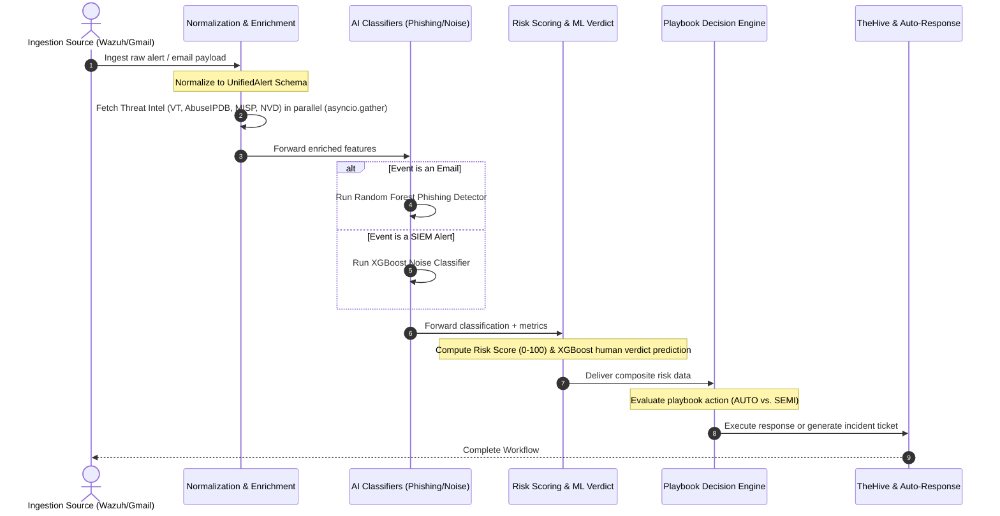

# CyberNest SOAR — AI Pipeline & Workflow Documentation

This document describes the end-to-end **AI Pipeline and Workflow** of the CyberNest-SOAR system. It details the sequential execution flow, data pathways, enrichment integrations, and decision-making logic of the AI models when a new security event or email is processed.

---

## 1. End-to-End AI Workflow Architecture

When a security alert or email enters the CyberNest-SOAR ecosystem, it triggers a multi-stage workflow where heuristic scoring, machine learning classifiers, and Large Language Models (LLMs) collaborate to triage and resolve the event.



---

## 2. Step-by-Step Execution Workflow

### Stage 1: Ingestion & Schema Normalization
1.  **SIEM Alerts:** Wazuh alert payloads are fetched from OpenSearch.
2.  **Emails:** Raw email content (sender, subject, body, attachments) is fetched from Gmail via the sync scheduler.
3.  **Schema Alignment:** The parser normalizes variables into the 111-field [UnifiedAlert Schema](file:///c:/Users/Pavlly/OneDrive/Desktop/SOAR/CyberNest-Soar/docs/api.md#L594).

### Stage 2: Asynchronous Threat Intel & Context Enrichment
Before any model makes a prediction, the alert is enriched with telemetry in parallel using `asyncio.gather` with a 5-second timeout:
*   **External Reputations:** IP addresses and hashes are checked against **VirusTotal** and **AbuseIPDB**.
*   **Internal Threat Intelligence:** Indicators of compromise (IOCs) are queried against the local **MISP** instance.
*   **Vulnerability Metadata:** If the alert description matches a CVE pattern, **NVD (CVSS)** and **EPSS** scores are fetched.
*   **Private IP Handling:** External reputation lookups are bypassed for RFC1918 private IPs to prevent rate-limit exhaustion.

### Stage 3: High-Fidelity AI Classification
The system routes the alert to the appropriate classifier based on the event source:

#### Path A: Phishing Detection (Emails)
*   **Vectorization:** Email body text is converted to numerical feature weights using a vocabulary-fitted TF-IDF vectorizer.
*   **Heuristics:** Text cleaning runs in parallel to extract characteristics (e.g. spelling errors, exclamation mark count, capital letter ratios, presence of URL shorteners).
*   **Classifier:** The [SklearnDetector](file:///c:/Users/Pavlly/OneDrive/Desktop/SOAR/CyberNest-Soar/backend/app/ai/phishing_model.py#L44) Random Forest model generates a classification (`suspicious` vs. `safe`) and confidence probability.

#### Path B: Noise Reduction & Suppression (SIEM Logs)
*   **Data Preparation:** Categorical values (roles, departments, protocols) are one-hot encoded, and missing fields are set to baseline scalars.
*   **Classifier:** The XGBoost model classifies the alert as `Actionable` or `Noise`.
*   **Confidence Cascade:** 
    *   **High Confidence (Confidence >= 85%):** Immediately resolved.
    *   **Medium Confidence (15% < Confidence < 85%):** Rerouted to the Large Language Model (LLM) refinement layer. The LLM reviews the environmental context (e.g., maintenance windows, administrator activity) to finalize the classification.

### Stage 4: Risk Prioritization & Analyst Verdict Prediction
All triaged events are evaluated by the [Risk Scoring Engine](file:///c:/Users/Pavlly/OneDrive/Desktop/SOAR/CyberNest-Soar/backend/app/soar_backend/services/risk.py):
1.  **Composite Risk Score:** A continuous score from 0-100 is calculated:
    $$\text{RiskScore} = \min((\text{Severity} \times 10) + (\text{CVSS} \times 5) + (\text{EPSS} \times 50) + (\text{AbuseIPDB} \times 0.5) + (\text{VirusTotal} \times 0.5), 100)$$
2.  **Analyst Verdict Prediction:** An XGBoost classification model assesses the enriched details to forecast how a human analyst would label the case (`true_positive`, `suspicious`, `false_positive`, `benign`).

### Stage 5: Intelligent Playbook Action Recommendation
The composite risk metrics, predicted analyst verdict, and MITRE tags are passed to the [Playbooks Decision Engine](file:///c:/Users/Pavlly/OneDrive/Desktop/SOAR/CyberNest-Soar/backend/app/soar_backend/services/playbooks.py):
*   **AUTO Action (High Risk, Score >= 90):** Triggers immediate, automated mitigation playbooks (e.g., Host Isolation, IP Blocking).
*   **SEMI-AUTO Action (Medium Risk, 30 < Score < 90):** Prompts the analyst with a recommended action (e.g., Credential Reset, Ticket Creation) waiting for human approval.
*   **Suppression (Low Risk / Noise):** Auto-closes the alert, records the metric, and filters it out of the main dashboard.

---

## 3. Data Flow and Feature Matrix

The table below maps which features feed into which AI model along the pipeline:

| Feature Name | Feature Type | Phishing Model | Noise Model | Risk Engine | Playbook Engine |
| :--- | :--- | :---: | :---: | :---: | :---: |
| Email Text (TF-IDF) | NLP Vector | Yes | No | No | No |
| alert_severity | Numerical | No | Yes | Yes | Yes |
| enrichment_vt_score | Numerical | No | Yes | Yes | Yes |
| enrichment_abuse_score| Numerical | No | Yes | Yes | Yes |
| enrichment_epss_score | Numerical | No | No | Yes | Yes |
| similar_alerts_last_hour| Numerical | No | Yes | Yes | Yes |
| asset_criticality | Categorical | No | Yes | Yes | Yes |
| maintenance_window | Boolean | No | Yes | No | Yes |
| user_role | Categorical | No | Yes | No | No |
| mitre_tactic | Categorical | No | No | No | Yes |

---

## 4. Operational API Flow

To trigger this workflow programmatically, the system relies on sequential API calls. The primary orchestration endpoint is `/alerts/batch/process` which executes this workflow on a batch of alerts.

```
Incoming Alert Batch
   │
   ▼
[POST] /api/v1/alerts/batch/enrich  ───► Fetches VT, AbuseIPDB, MISP
   │
   ▼
[POST] /api/v1/alerts/filter        ───► Runs XGBoost Noise Reduction
   │
   ▼
[POST] /api/v1/risk-score/batch     ───► Calculates 0-100 Score & Predicts Verdict
   │
   ▼
[POST] /api/v1/playbooks/decision   ───► Evaluates Playbook actions
   │
   ▼
Response payload returned to the caller
```
